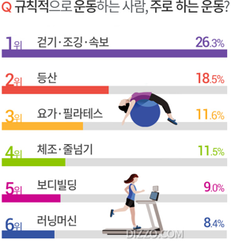
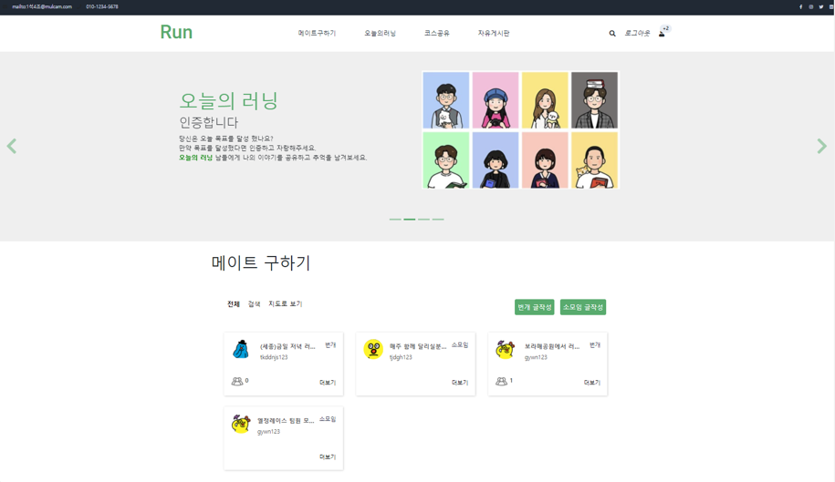
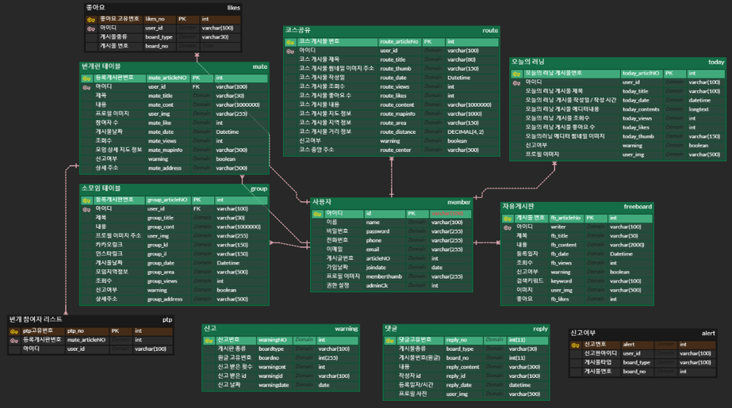

# 🏃‍♂ 러닝메이트 🏃‍♀
러닝에 대한 여러가지 정보를 공유하고 러닝메이트를 구하느 러닝 커뮤니티 사이트

 

## 러닝메이트란?
- 번개 모임 과 소모임 구분
- 번개 모임의 정확한 위치 정보 제공
- 코스 공유(사용자가 지도에 직접 코스를 그려 공유할 수 있음)
- 러닝 다이어리(러닝 인증)

 
 
## 만들게된 배경
- 한국인 중 주 3회 이상 하루 30분 이상 운동 하는 비율은 42.7% 정도
- 그 중에 가장 높은 비율의 운동은 걷기 및 조깅(러닝)
- 운동을 혼자 하다가 흥미를 갖기전에 관두는 경우가 多
- 러닝코스 공유등과 운동할 메이트를 만들 수 있는 플랫폼을 만들고자 프로젝트를 시작함

 
 
&nbsp;&nbsp;&nbsp;&nbsp;&nbsp;&nbsp;&nbsp;

 

## 팀 역할

 

 <b>채효주</b> 

* 로그인, 회원가입 CRUD 구현
* 마이페이지 JSP 디자인 설계 및 구현
* 내가 쓴 글 보기
* 회원목록 조회 / 회원 강제 탈퇴
* 신고목록 조회 및 해당 게시물 삭

 

 <b>홍성호</b> 

* 러닝메이트 구하기 JSP 구성 설계 및 구현
* 번개, 소모임 게시물 CRUD
* 번개 참여 기능, 참여자 리스트 기능
* 게시물 검색 기능(게시물 종류, 제목등)
* CKEditor5로 게시물 구현
* KaKao Map API 사용: 현재 위치 정보, 지도로 보기 등 구현
 

 

 <b>김상원</b> 

* 메인페이지 JSP 디자인 설계 및 구현
* 최고의 러너 구현(오늘의 러닝) / 번개모임 미리보기
* 자유게시판 CRUD 페이징리스트 구현
* CKEditor5로 게시판 구현
* 게시글 검색 기능(제목, 작성자, 내용)
* 댓글 front 구성 설계 및 구현
 

 

 <b>조예선</b> 

* 나처럼 달려페이지 JSP 구성 설계 및 구현
* 게시물 CRUD 페이징 구현
* CKEditor5로 게시물 구현
* Mapbox API 사용하여 코스 그리기
* 전체 댓글 기능 CRUD
* 전체 좋아요, 신고 DB 설계 및 구현

 

 <b>김민정</b> 

 
* 오늘의 러닝 JSP 구성 설계 및 구현
* 오늘의 러닝 CRUD 페이징 구현
* 게시물 썸네일 기능 구현
* CKEditor5로 게시물 구현
* 게시물 썸네일 기능 구현

 
 
## Demo

 
 
## 기능

 <b>메인, 회원, 마이페이지, 관리자 페이지</b> 

 <b>메이트 구하기</b> 

 <b>오늘의 러닝</b> 

 <b>코스 공유</b> 

 <b>자유게시판</b> 

 

## 클래스 구조

 

## 데이터베이스

 

## 기술 스택

 <b>Back-end</b> 

* JAVA SE-11
* Spring Boot
* Spring MVC

 

 <b>Front-end</b> 

* HTML5
* CSS
* JavaScript

 

 <b>DBMS</b> 

* MySQL

 

 <b>DevOps</b> 

* GitHub
* Naver Works
* oven.app
* ERDCloud
 

 

 <b>API & Library</b> 

* KaKao API - 지도
* Mapbox Geolocation API

 
 
멀티캠퍼스 풀스택 세미프로젝트 
